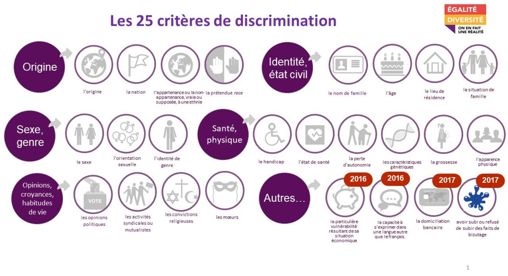
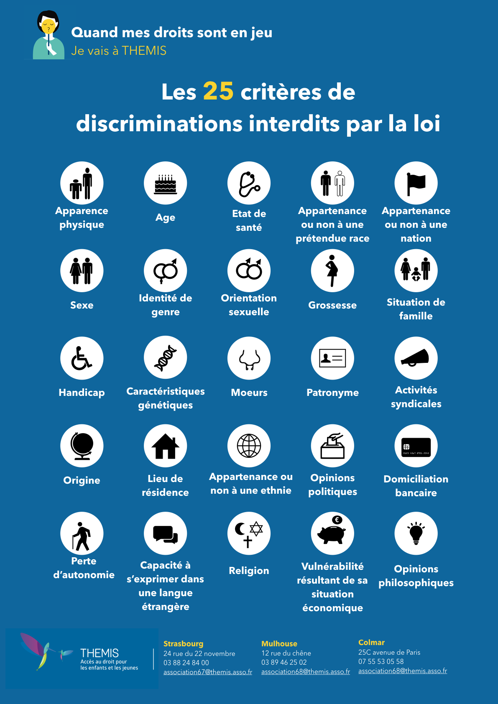

# Période d'intégration

### Période d'intégration

[Voir "Entrée formation"](CDA23016_Entrée_Formation.pdf)

### La veille technologie

[Voir "Veille Technologique"](CDA_VEILLE%20TECHNO_JBO.pdf)
[Voir "Les acronymes"](CDA23016_les_acronymes.pdf)

### La Transition Energétique

[Voir "Transistion Énergétique"](CDA_TRANSITION_ENERGETIQUE.pdf)

### La Cybersécurité

[Voir "Enjeux Sécurité"](CDA_Enjeux_Securité.pdf)
[Voir "Quizz ANSSI"](quizzANSSI.pdf)

### Les Droits et Devoirs du salarié

[Voir "Droits et devoirs du salarié"](CDA_Droits%20et%20devoirs%20du%20salariés.pdf)

### Parcours citoyen - Vivre et travailler ensemble

### Présentation du titre et de l'examen

[Voir "Présentation Titre et Examen"](CDA_Présentation_Titre_et_Examen.pdf)